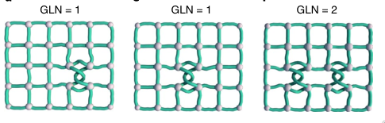
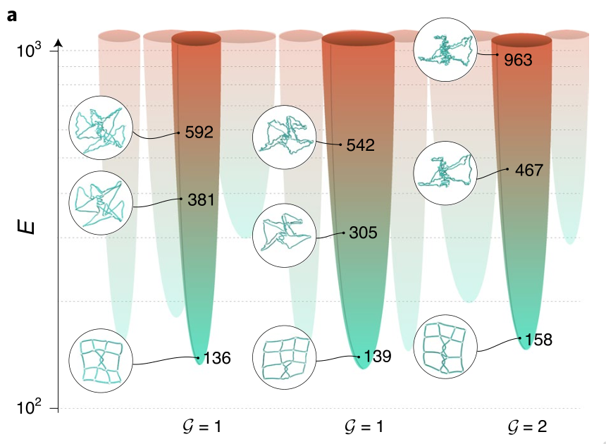
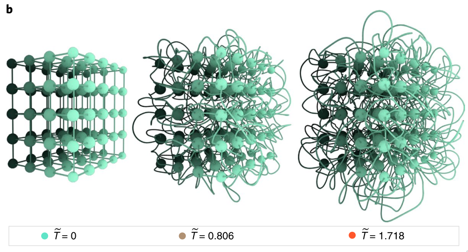
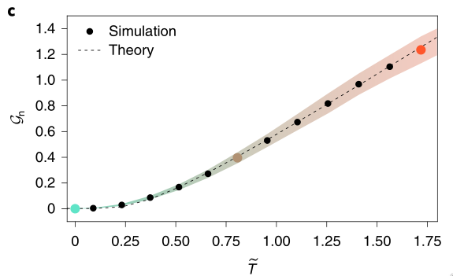
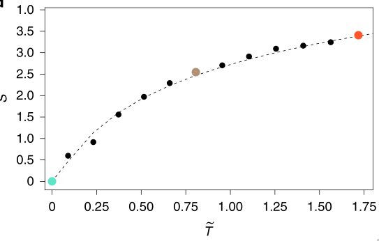
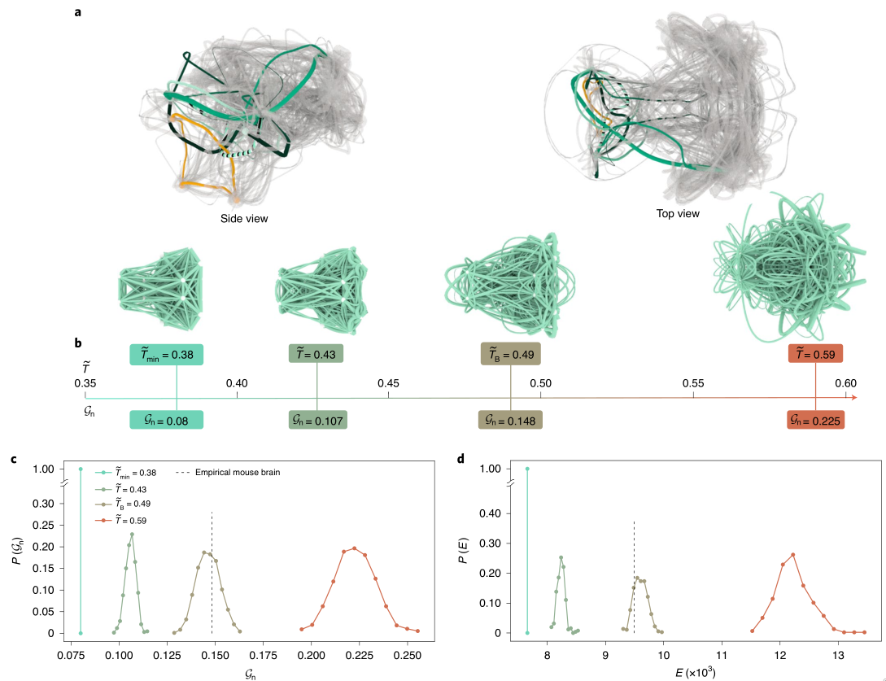

$\pagebreak$

# The Motivation

The first thing any course in Network Science does is the adjacency matrix of a graph. While extremely flexible and expressive of varied graphs, adjacency matrices cannot explain the physical configuration of a network in the space that it is embedded in. 

Further, in case of 2 Dimensions, there are non-planar graphs, but all graphs can be embedded in 3 dimensions without link overlap, and there are infinite ways to do so. But many of those are simply "smooth" reconfigurations of each other, that is, we can go from one configuration to another without having to break any edges. These configurations can be called isotopic, and we would like to develop tools which can classify a physical graph on the basis of this isotopy.

By looking at the isotopy number of a graph, we can also look at the number of unresolvable "knots" in the graph. The number of knots gives us some measure of disorder, or entropy $S$, in the system. Similarly, we can define the total length of edges as some measure of energy $E$ of a configuration. Together, we can define the "temperature" $T$ of the graph as $\frac{S}{E}$.

With this entire framework, one may also find interesting insights into the properties of certain physical networks such as brain connectomes and vascular systems.

This review of [@barabasi] introduces the above methods with results and the significance of the same.

# Methodology and Approach

## Topology and Graph Linking Number

To begin with, they determine if two graphsare non-isotopic. They use the Linking Number, which is also a knot invariant which counts the number of times two closed loops wind around each other. They generalize this to what they call the graph linking number, which is just the sum of the linking number $\mathcal{L}$ over all pairs of cycles. That is, 

$$\mathcal G\{\epsilon\} = \sum_{c, c'\in \{C\}} |\mathcal{L}(\epsilon; c, c')|$$

where $\{C\}$ is the minimal loop set in the embedding $\epsilon$, and $\mathcal{L}$ is the linking number between cycle $c$ and $c'$ in that embedding.

It is to be noted that $\{C\}$ is fully determined by the adjacency matrix and $\mathcal{L}$ is given by the embedding only. If cycles share nodes, then $\mathcal{L}$ is considered to be 0.

Since larger, networks have more cycles, $\mathcal{G}_n=\mathcal{G}/N_p$ is the normalized GLN (nGLN), where $N_p$ is the number of cycles.

## The Energy of a Network

Since edges are often costly to build in physical networks, we can give them an energy cost which is linear in the total length of the edges. Hence,

$$V_{el}[\{\gamma_l\}] = \sum_l \int_0^1 \left|\frac{\bold{dx_l}}{ds}\right|^2 ds$$

where $\gamma_l$ is the path for the $l^th$ edge and $s$ is the unit length parametrization of the curve, and $|\bold{dx_l}|$ is the location of the segment of $l$ from parameter value $s$ to $s+ds$.

However, we also want to add shortrange repulsions for the nodes and edges to prevent overlap.

$$V_{NN}\approx A_M \sum_{ij}\exp[X_i - X_j/2r_N]^p$$

$$V_{LL}\approx A_L \sum_{lm}\int\int ds_l ds_m \exp[x_l - x_m/2r_L]^p$$

where $A_M, A_L$ are amplitudes, $X_i, X_j$ are positions, $x_l, x_m$ are path segments, and $p$ represents the hardness of the potential.

This formulation may seem arbitrary, but it provides multiple insights. First, the shortest wiring length embedding is also the least energy configuration without link crossing. Since there must be multiple minimas, the problem of finding the global minima is similar to the protein folding problem which is known to be NP Complete.

But, what is more interesting is the following observation. Since energy cost of link crossing is infinite, there are distinct wells created. Further, since all embeddings of equal link crossings can be continuously deformed to each other, they must be within the same well. Hence, the energy landscape is made by distinct wells, one each for an isotopy class.

{width=50%} 

{width=50%}

## Temperature

To see the relation more clearly, we can introduce a parameter $T$ in a canonical ensemble. Then, the partition function 

$$\begin{aligned}
Z &= \sum_{\text{Link paths }\gamma}\sum_{\text{Node pos.}} exp[-V_{el}/k_bT]\\
Z &= \int \prod_{i=1}^N d^3 X_i Z_l [\{X_i\}]
\end{aligned}$$

where $Z_l[\{X_i\}]$ is the partition function for all ink configurations for a fixed node positions.

By applying the mean-field approximation and noting that higher order tangles give exponentially smaller energy contributions, we can simplify 

$$Z = e^{-\beta E_0}\prod_n Z_n$$

and from usual statmech techniques,

$$\langle E\rangle = E_0 + \sum_nC_n \langle\epsilon_n\rangle = E_0 + \langle\mathcal G\rangle \epsilon $$

where $\epsilon$ is the energy cost of a tangle.

Similar analysis leads to the entropy 

$$S = -N_p \log(1-e^-{\beta\epsilon}) + \frac{N_p\beta\epsilon}{e^{\beta\epsilon} - 1}$$

By defining $\tilde{T} = \frac{T}{\epsilon}$, we get that $\langle G_n\rangle = 1/(e^{\tilde{\beta}} -1)$

# Key Results

## Testing the model

Variations in path lead to a variation in $E$ of the configuration, and hence the temperature $T$. Explicitly,

$$\tilde{T(\delta)} - \tilde{T}_\text{min} = \frac{\delta}{\epsilon\sqrt{\frac{N_p\epsilon^2}{8kE_0}}}$$

{ width=75% }

To test the model, the authors generated 3D lattices by varying the wire paths and extracted the $\tilde T$ as per the above equation. By calculating $\langle \mathcal G_n\rangle$ from the simulated graph and from the $\mathcal G_n$ - $\tilde{T}$ equation they verify the validity of the assumptions. The same is also done with the entropy, which also has excellent match.

{ width=50% } { width=50%} 

## Mouse Brain

By analyzing the connectome of the mouse brain, they estimate the efficiency of the structure. Since axons have metabolic costs associated with them, it is hypothesized that the least energy configuration will be picked. By measuring the $\mathcal G_n$ and the most economical linking at $\tilde{T} = \tilde{T}_\text{min}$, we geth that the $\mathcal G_n(\text{mouse}) = 0.148$ and $\mathcal G_n(\text{best})=0.008$. Similarly, $\tilde T(\text{mou}) = 0.49$ and $\tilde T(\text{max}) \approx 0.66$ (limitation due to the brain size). It is also noted from before that $\tilde T$ is a good representation of the layout variability of the mouse brain.

{height=30%}

# Significance of the work

This work is one of the first (according to the authors) works in trying to classify embedded networks according to their isotopy and providing theoretical and practical tools to measure variability.

By exploiting the fact that isotopic layouts have their own energy wells, the authors have built a statistical mechanical model which allowed them to derive layout characteristics from a single parameter, the layout temperature.

On the more real world implications, as more brain data becomes available, the authors believe that we may be able to predict onset of brain diseases such as schizophrenia by measuring the brain "Temperature".

Finally the work also shows that certain network problems could be solved, at least statistically, by mapping it to the dual problem in the topology space and vice-versa. 

$\pagebreak$

# References
